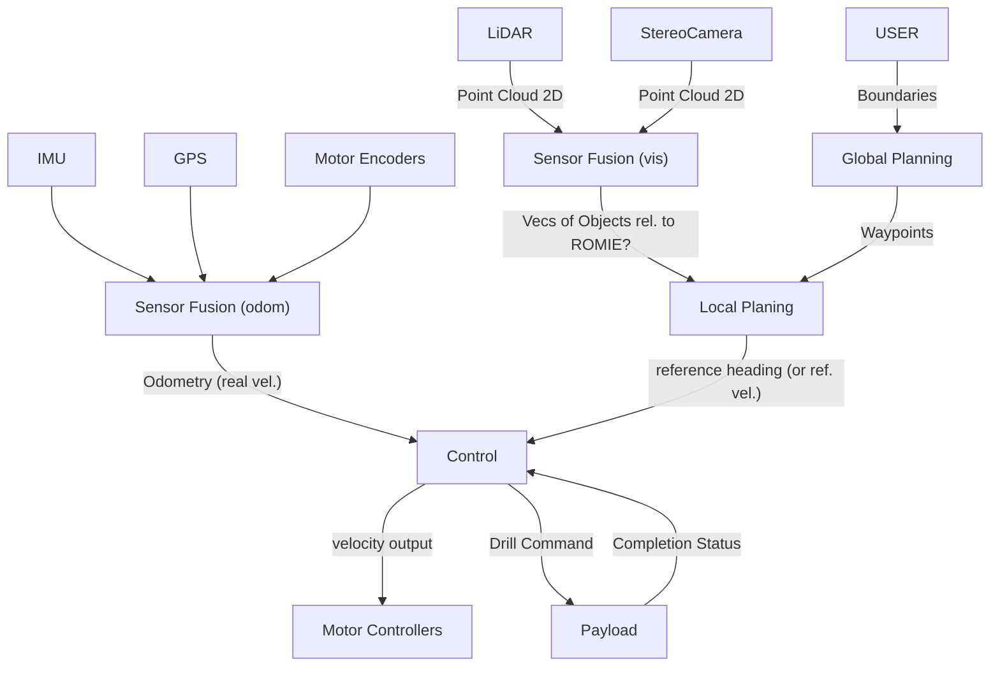

# Travelling-Postman-Problems-Algorithms-
This repository contains a series of different TSP algorithms which will simulate the optimal path for an agent positioned in a middle of a square grid of X points

# Details to run TSPP app
Go into the TSPP/myapp directory and run
```bash
python3 manage.py runserver
```

# This is the file structure

# This what to expect from the user interface




# This is the react web interface to choose the sampling point coordinate in Africa

